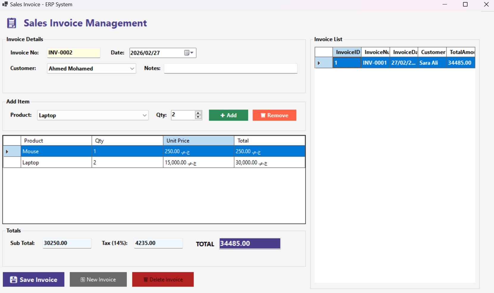

# Sales Invoice ERP - Desktop Application

A Windows Forms desktop ERP application for managing sales invoices, built with C# (.NET Framework) and SQL Server.

---

## 🛠️ Tech Stack

- **Language:** C# (.NET Framework 8.0)
- **UI Framework:** Windows Forms
- **Database:** Microsoft SQL Server

---

## 🚀 How to Run

### Step 1: Setup the Database

1. Open **SQL Server Management Studio (SSMS)**
2. Open the file: `Database/DatabaseScript.sql`
3. Run the script — it will create the database, tables, and sample data

### Step 2: Configure Connection String

1. Open `SalesInvoiceApp/App.config`
2. Update `YOUR_SERVER_NAME` with your SQL Server instance name:
   ```xml
   connectionString="Server=YOUR_SERVER_NAME;Database=SalesInvoiceDB;Integrated Security=True;"
   ```
   > **Example:** If you're using a local default instance, use `Server=.` or `Server=localhost`

### Step 3: Open in Visual Studio

1. Open **Visual Studio** (2019 or later recommended)
2. Create a new **Windows Forms App (.NET Framework)** project
3. Add all `.cs` files from `SalesInvoiceApp/` to the project
4. Replace `App.config` with the provided one
5. Install the `System.Configuration` reference if missing (right-click References → Add Reference)
6. Build and Run (`F5`)

---

## ✅ Features

| Feature                                                | Status |
| ------------------------------------------------------ | ------ |
| Auto-generated invoice numbers (INV-0001, INV-0002...) | ✅     |
| Customer selection via dropdown                        | ✅     |
| Add multiple products per invoice                      | ✅     |
| Auto-calculate subtotal, tax (14%), and total          | ✅     |
| Save new invoice                                       | ✅     |
| Edit existing invoice (double-click from list)         | ✅     |
| Delete invoice                                         | ✅     |
| Invoice list panel with all invoices                   | ✅     |
| Transaction support (rollback on error)                | ✅     |

---

## 📸 How to Use

1. **Create Invoice:** Fill in customer, add products, click "Save Invoice"
2. **Edit Invoice:** Double-click any invoice from the list on the right
3. **Delete Invoice:** Load an invoice then click "Delete Invoice"
4. **New Invoice:** Click "New Invoice" to reset the form

---

## 📝 Notes

- At least one item must be added before saving
- Customer selection is required
- Invoice numbers are generated automatically and cannot be edited
- Tax rate is set to 14% (VAT) — can be changed in `InvoiceForm.cs` via `_taxRate` field

---

## 👤 Author

Built as part of technical task.

---
## 📸 Screenshots
### UI


